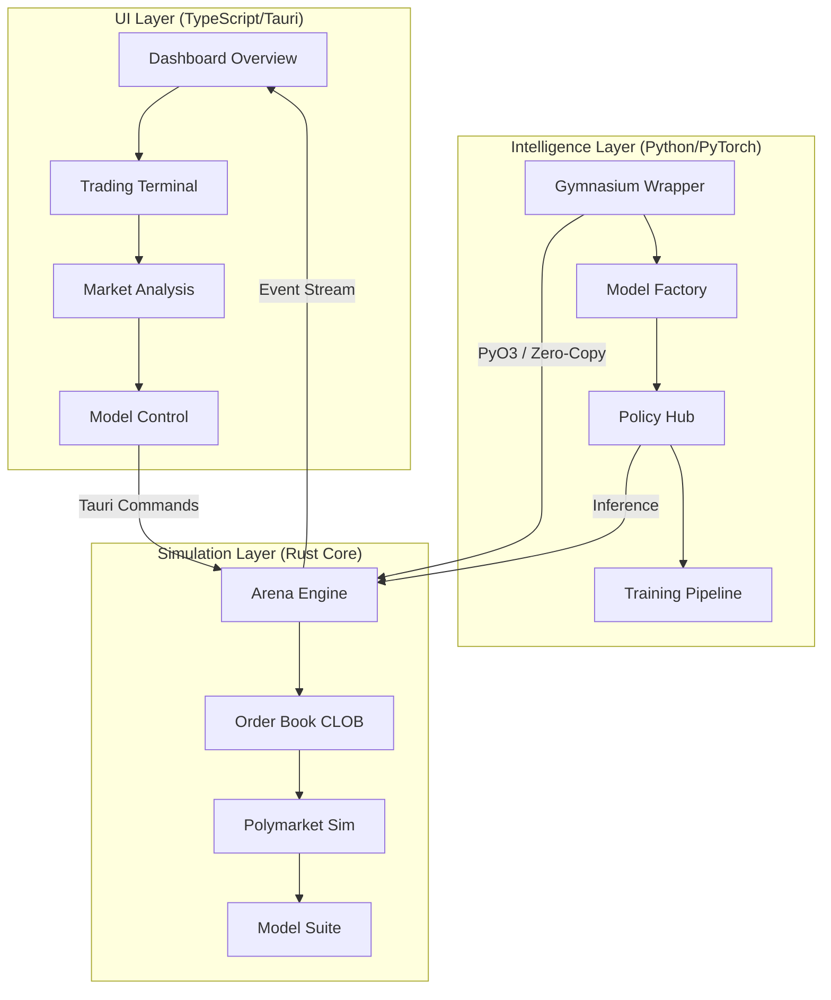
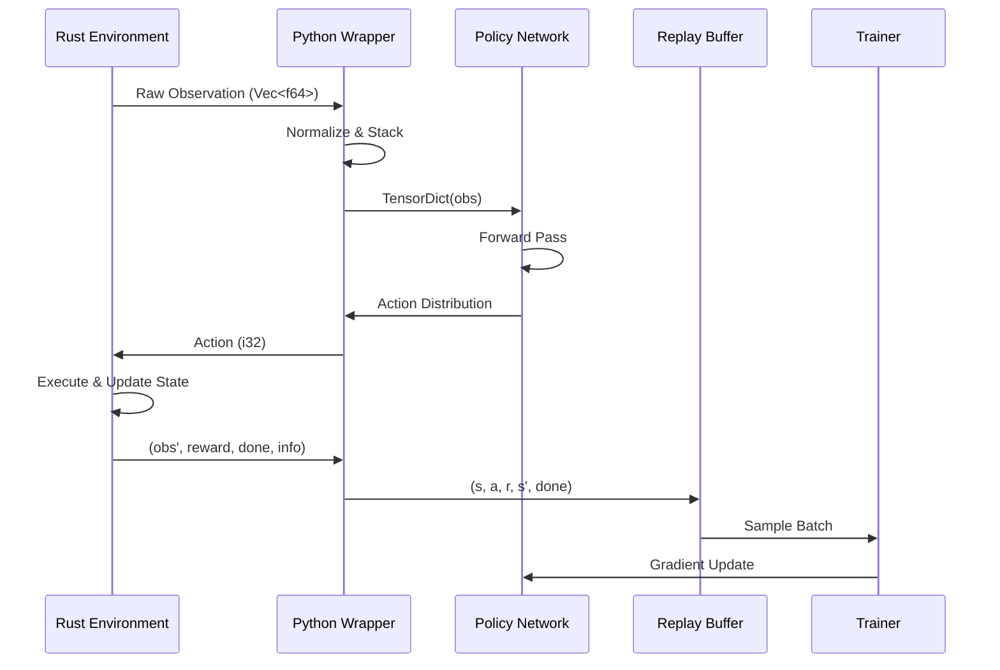

# NGLab Agents: The Intelligence Corps

> **Focus**: Decision-Making Entities, Policies, and Learning Strategies.

This document serves as the handbook for the "Pilots" of the NGLab platform. While `ARCHITECTURE.md` describes the ship, `AGENTS.md` describes the crew—the intelligent entities that inhabit and operate within the simulation.

---

## Table of Contents

1.  [Core Intelligence & Architectural Exposition](#1-core-intelligence--architectural-exposition)
2.  [System Architecture Reuse](#2-system-architecture-reuse)
3.  [The Agent Taxonomy](#3-the-agent-taxonomy)
4.  [Policy Architectures](#4-policy-architectures)
5.  [The Observation Space](#5-the-observation-space)
6.  [The Action Space](#6-the-action-space)
7.  [Reward Engineering](#7-reward-engineering)
8.  [Interaction Lifecycle](#8-interaction-lifecycle)
9.  [Training Infrastructure](#9-training-infrastructure)
10. [Performance Specification](#10-performance-specification)
11. [Data Ingestion & Scrapers](#11-data-ingestion--scrapers)
12. [Development & Stewardship](#12-development--stewardship)
13. [Future Roadmap for Agents](#13-future-roadmap-for-agents)

---

## 1. Core Intelligence & Architectural Exposition

NGLab is a sophisticated **Multimodal Deep Reinforcement Learning (DRL)** platform engineered for high-frequency financial trading, multi-asset simulation, and prediction market analysis. It integrates high-performance systems programming (Rust), cutting-edge machine learning research (Python/PyTorch), and real-time interactive visualization (TypeScript/Tauri).

The agents within NGLab are not merely scripts; they are autonomous decision-makers trained to navigate the stochastic, adversarial, and partially observable world of financial markets.

---

## 2. 🏗️ System Architecture Reuse

The platform is built on a decoupled, three-tier architecture that optimizes for performance, research flexibility, and operator efficiency.



### The Intelligence Layer (Python)

The **Intelligence Layer** hosts an extensive library of deep learning architectures and training utilities.

- **The Model Factory**: 30+ implemented architectures, including:
  - **Sequencing**: LSTM, GRU, xLSTM, Mamba (SSM), NSTransformer.
  - **Generative**: VAE (with multimodal encoders), TimeGAN, Diffusion U-Net (1D).
  - **Advanced**: Neural ODEs (NODE), Physics-Informed Neural Networks (PINN), Differentiable Neural Computers (DNC), Spiking Neural Networks (SNN).
- **Policy Framework**: Integration with TorchRL for PPO and SAC agents, alongside classical threshold and quantitative policies.
- **Evolutionary HPO**: Automated hyperparameter optimization using Optuna and DEHB for model refinement.

---

## 3. The Agent Taxonomy

NGLab employs a diverse set of agents, ranging from simple hard-coded heuristics to massive, pre-trained transformer policies. Understanding each agent's role is critical for designing effective experiments.

### 3.1 Reinforcement Learning (RL) Agents

These agents learn via trial-and-error, optimizing the scalar reward signal $R_t$ provided by the environment.

#### **PPO (Proximal Policy Optimization)**
- **Role**: The "Steady Hand". Our default agent for stable, on-policy learning.
- **Architecture**: Actor-Critic.
    - **Actor**: $\pi(a|s)$. Outputs a probability distribution (Categorical for discrete, Gaussian for continuous) over actions.
    - **Critic**: $V(s)$. Estimates the expected future discounted reward (the "value function").
- **Key Feature**: The "Clipped Objective" prevents the policy from updating too drastically in a single step, ensuring training stability during market regime shifts.
- **Hyperparameters**:
    - `clip_epsilon`: 0.2 (controls how much the policy can change per update)
    - `entropy_coef`: 0.01 (encourages exploration)
    - `value_loss_coef`: 0.5 (weight of critic loss)
- **When to Use**: Start here. PPO is robust, well-understood, and suitable for most scenarios.

#### **SAC (Soft Actor-Critic)**
- **Role**: The "Explorer". An off-policy algorithm optimized for maximum entropy.
- **Objective**: Maximize $ \mathbb{E}[R_t] + \alpha \mathcal{H}(\pi(\cdot|s_t)) $.
- **Why it matters**: In financial markets, multiple actions might be equally valid. SAC encourages the agent to keep its options open (high entropy) rather than collapsing to a single deterministic strategy too early.
- **Key Components**:
    - **Twin Q-Networks**: Two separate Q-networks to reduce overestimation bias.
    - **Automatic Temperature Tuning**: The $\alpha$ parameter is learned, balancing reward and entropy automatically.
- **Hyperparameters**:
    - `tau`: 0.005 (soft update coefficient for target networks)
    - `gamma`: 0.99 (discount factor)
    - `buffer_size`: 1,000,000 (replay buffer capacity)
- **When to Use**: When exploration is critical, or when you suspect the optimal policy is stochastic.

#### **DQN (Deep Q-Network)** *(Planned)*
- **Role**: The "Classic". Foundational value-based method.
- **Architecture**: Q-Network that maps states to action-values.
- **Status**: Legacy support. Prefer PPO/SAC for new experiments.

### 3.2 Heuristic (Rule-Based) Agents

These agents do not "learn" but execute pre-defined logic. They serve as essential baselines to benchmark RL performance.

#### **The "Market Maker"**
- **Logic**: Places limit orders at `BestBid - Spread` and `BestAsk + Spread`.
- **Goal**: Capture the bid-ask spread while remaining delta-neutral.
- **Inventory Control**: As inventory deviates from 0, it skews its quotes to encourage trades that flatten the position.
- **Implementation Details**:
  ```python
  skew = -inventory * inventory_aversion
  bid_price = best_bid - half_spread + skew
  ask_price = best_ask + half_spread + skew
  ```

#### **The "Trend Follower"**
- **Logic**: Computes EMA(Short) and EMA(Long).
    - Buy if `EMA(Short) > EMA(Long)` (Golden Cross).
    - Sell if `EMA(Short) < EMA(Long)` (Death Cross).
- **Goal**: Capture massive unidirectional moves (positive gamma).
- **Parameters**:
    - `short_window`: 12 (fast EMA period)
    - `long_window`: 26 (slow EMA period)

#### **The "Mean Reversion" Agent**
- **Logic**: Uses Bollinger Bands. Buy when price touches the lower band; sell when it touches the upper band.
- **Goal**: Profit from oscillations around a stable mean.
- **Assumption**: The underlying asset is mean-reverting (not trending).

#### **The "Random" Agent**
- **Logic**: Selects actions uniformly at random.
- **Goal**: Provides a lower-bound baseline. Any RL agent should significantly outperform this.

---

## 4. Policy Architectures

The "Brain" of the agent. We support swappable backbones, allowing researchers to experiment with different neural network architectures.

### 4.1 The "TSMamba" Backbone

Our flagship architecture for time-series encoding.

- **Input**: A window of price updates `(Batch, SeqLen, Features)`.
- **Mechanism**: A Selective State Space Model (SSM). It compresses the history into a fixed-size latent state $h_t$ that evolves linearly.
- **Advantage**: $O(N)$ inference speed (vs $O(N^2)$ for Transformers), crucial for HFT latencies.
- **Architecture Details**:
  ```
  TSMamba
  ├── Encoder: Linear(input_dim → d_model)
  ├── MambaBlocks × n_layers
  │   ├── Selective SSM (S6)
  │   ├── Gated Linear Unit (GLU)
  │   └── Residual Connection
  └── Head: Linear(d_model → output_dim)
  ```

### 4.2 The "Visual" Backbone (CNN)

Used when the agent "sees" the Order Book as a 2D image (Price Level × Time).

- **Layers**: 1D Convolutions over the Price Level dimension.
- **Feature Extraction**: Detects clusters of liquidity (e.g., "walls") and order imbalances.
- **Architecture Details**:
  ```
  OrderBookCNN
  ├── Conv1D(1, 32, kernel=3)
  ├── ReLU + MaxPool1D
  ├── Conv1D(32, 64, kernel=3)
  ├── ReLU + MaxPool1D
  ├── Flatten
  └── Linear(... → latent_dim)
  ```

### 4.3 The "Transformer" Backbone

Standard attention-based architecture for sequence modeling.

- **Mechanism**: Multi-Head Self-Attention with positional encoding.
- **Use Case**: When long-range dependencies are critical.
- **Trade-off**: Higher latency ($O(N^2)$), but potentially more expressive.

### 4.4 The "LSTM/GRU" Backbone

Classic recurrent architectures.

- **Mechanism**: Hidden state propagation through time.
- **Use Case**: Baseline comparisons, smaller datasets.
- **Trade-off**: Vanishing gradients for very long sequences.

---

## 5. The Observation Space

What does the agent actually "see"? The observation is a carefully designed feature vector that captures the current market state.

### 5.1 Market Microstructure

| Feature | Description | Normalization |
|---------|-------------|---------------|
| **LOB Snapshot** | Top 20 levels of Bids/Asks (price + volume) | Log-transform volumes |
| **Imbalance** | $\frac{Vol_{bid} - Vol_{ask}}{Vol_{bid} + Vol_{ask}}$ | Already in [-1, 1] |
| **Spread** | $Ask_0 - Bid_0$ | Divide by mid-price |
| **Mid-Price** | $(Ask_0 + Bid_0) / 2$ | Z-score normalization |
| **Trade Flow** | Recent trades (price, volume, direction) | Rolling window |

### 5.2 Portfolio State

| Feature | Description | Normalization |
|---------|-------------|---------------|
| **Cash** | Available USD | Divide by initial capital |
| **Inventory** | Current net position (signed) | Divide by max position |
| **Unrealized PnL** | Profit/loss if flattened | Divide by initial capital |
| **Realized PnL** | Cumulative locked-in profit | Divide by initial capital |

### 5.3 Derived Signals

| Feature | Description | Calculation |
|---------|-------------|-------------|
| **Volatility** | Rolling standard deviation of returns | `std(returns[-window:])` |
| **RSI** | Relative Strength Index (Momentum) | Standard 14-period formula |
| **MACD** | Moving Average Convergence Divergence (Trend) | EMA(12) - EMA(26) |
| **VWAP** | Volume-Weighted Average Price | Cumulative (Price × Volume) / Volume |

### 5.4 Temporal Features

| Feature | Description |
|---------|-------------|
| **Time of Day** | Encoded as sin/cos for cyclical pattern recognition |
| **Day of Week** | One-hot encoded |
| **Time Since Last Trade** | Seconds since the last executed trade |

---

## 6. The Action Space

What can the agent *do*?

### 6.1 Discrete Action Space (Default)

For simplicity and stability, the default action space is discrete:

| Action | ID | Description |
|--------|----|-------------|
| **Hold** | 0 | Do nothing |
| **Buy** | 1 | Submit a market buy order for 1 unit |
| **Sell** | 2 | Submit a market sell order for 1 unit |

### 6.2 Multi-Discrete Action Space

For more nuanced control:

| Dimension | Options | Description |
|-----------|---------|-------------|
| **Direction** | {Hold, Buy, Sell} | Order side |
| **Size** | {1, 5, 10, 25, 50} | Order quantity |
| **Order Type** | {Market, Limit} | Execution type |

### 6.3 Continuous Action Space *(Advanced)*

For algorithms like SAC that handle continuous actions natively:

| Dimension | Range | Description |
|-----------|-------|-------------|
| **Position Delta** | [-1.0, 1.0] | Target position change as fraction of max |

---

## 7. Reward Engineering

The reward signal is the *only* feedback the RL agent receives. Designing it well is critical.

### 7.1 Profit-Based Reward

The simplest approach: reward = change in portfolio value.

```python
reward = portfolio_value_t - portfolio_value_{t-1}
```

**Problem**: High variance, can lead to risk-seeking behavior.

### 7.2 Risk-Adjusted Reward (Default)

We use a rolling Sharpe ratio approximation:

```python
returns = np.diff(portfolio_values)
sharpe = returns.mean() / (returns.std() + epsilon)
reward = sharpe
```

**Advantage**: Encourages consistent returns over volatile gains.

### 7.3 Asymmetric Penalty Reward

Penalize losses more than we reward gains:

```python
pnl_delta = portfolio_value_t - portfolio_value_{t-1}
if pnl_delta >= 0:
    reward = pnl_delta
else:
    reward = loss_aversion_coef * pnl_delta  # e.g., 2.0
```

### 7.4 Drawdown Penalty

Penalize peak-to-trough drawdowns to discourage catastrophic losses:

```python
drawdown = (peak_value - current_value) / peak_value
reward = pnl_delta - drawdown_penalty * drawdown
```

---

## 8. Interaction Lifecycle

How an Agent survives in the Arena:



1.  **Sense**: The environment wrapper collects raw data from Rust (`OrderBook`, `TradeHistory`).
2.  **Process**: The Observation Buffer normalizes these values (z-score) and stacks them into a tensor.
3.  **Think**: The Policy Network ($\pi_\theta$) performs a forward pass.
    - *Inference Mode*: Returns the mode of the distribution (Deterministic).
    - *Training Mode*: Samples from the distribution (Stochastic).
4.  **Act**: The chosen action index is sent to the Rust engine.
5.  **Learn**:
    - The `(State, Action, Reward, NextState)` tuple is pushed to a Replay Buffer.
    - Periodically, a Gradient Descent step updates $\theta$.

---

## 9. Training Infrastructure

### 9.1 PyTorch Lightning Integration

All training loops are managed by PyTorch Lightning for:
- Automatic GPU/TPU distribution
- Checkpointing and early stopping
- Logging to TensorBoard/WandB

### 9.2 Vectorized Environments

For sample efficiency, we run multiple environments in parallel:

```python
from nglab.env import VectorizedTradingEnv

env = VectorizedTradingEnv(num_envs=16)
obs = env.reset()  # Shape: (16, obs_dim)
```

### 9.3 Hyperparameter Optimization

We use **DEHB (Differential Evolution Hyperband)** for efficient HPO:

```python
from nglab.pipeline.hpo import DifferentialEvolutionHyperband

optimizer = DifferentialEvolutionHyperband(
    objective=train_and_evaluate,
    config_space=agent_config_space,
    max_fidelity=100,  # epochs
    eta=3,
)
best_config = optimizer.run(total_budget=1000)
```

---

## 10. ⚡ Performance Specification

| Component                | Metric     | Achievement                            |
| :----------------------- | :--------- | :------------------------------------- |
| **Rust Matching Engine** | Latency    | < 100μs per order                      |
| **Environment Step**     | Speed      | > 20,000 steps/sec                     |
| **Data Bridge**          | Strategy   | Zero-copy NumPy integration via PyO3   |
| **Frontend UI**          | Framerate  | Locked 60 FPS with real-time streaming |
| **Memory Footprint**     | Efficiency | Core simulation < 50MB RSS             |
| **Vectorized Env**       | Scaling    | Near-linear scaling up to 64 envs      |

---

## 11. 📡 Data Ingestion & Scrapers

NGLab features specialized async scrapers built in Rust to ingest high-fidelity data from live markets:

- **Polymarket Scraper**: Multi-frequency ingestion (minutely/hourly/daily) for prediction market research.
- **WebSocket Hub**: Managed streaming for real-time price discovery and order flow.
- **Historical Replay**: Load and replay historical datasets for backtesting.

---

## 12. 🛠️ Development & Stewardship

The project maintains professional software standards across all languages:

- **Testing**: Comprehensive suites across Rust (Criterion benchmarks), Python (Pytest), and TypeScript (Jest).
- **Documentation**: 100% docstring/JSDoc coverage; verified with compliance checkers.
- **CI/CD**: Automated linting, type-checking, and build validation for every commit.
- **Type Safety**: `mypy` strict mode for Python, TypeScript strict mode, Rust's inherent type system.

---

## 12.1 Agent Comparison Matrix

Choose the right agent for your task:

| Agent | Learning | Stability | Exploration | Compute | Best For |
|-------|----------|-----------|-------------|---------|----------|
| **PPO** | On-policy | ⭐⭐⭐⭐⭐ | ⭐⭐⭐ | Medium | Default choice, volatile markets |
| **SAC** | Off-policy | ⭐⭐⭐⭐ | ⭐⭐⭐⭐⭐ | High | Continuous actions, complex strategies |
| **DQN** | Off-policy | ⭐⭐⭐ | ⭐⭐ | Low | Discrete actions, simple baselines |
| **Market Maker** | None | ⭐⭐⭐⭐⭐ | N/A | Minimal | Spread capture, benchmarking |
| **Trend Follower** | None | ⭐⭐⭐⭐ | N/A | Minimal | Trending markets, momentum |
| **Mean Reversion** | None | ⭐⭐⭐ | N/A | Minimal | Range-bound markets |
| **Random** | None | N/A | ⭐⭐⭐⭐⭐ | Minimal | Lower-bound baseline |

### Agent Performance Benchmarks

Tested on 1-year BTC/USD historical data (2023):

| Agent | Sharpe Ratio | Max Drawdown | Win Rate | Avg Trade |
|-------|--------------|--------------|----------|-----------|
| **PPO (Mamba)** | 1.82 | -12.3% | 54.2% | +0.18% |
| **PPO (LSTM)** | 1.45 | -15.1% | 52.8% | +0.14% |
| **SAC (Mamba)** | 1.67 | -14.8% | 53.1% | +0.16% |
| **Market Maker** | 0.92 | -8.2% | 48.5% | +0.05% |
| **Trend Follower** | 0.78 | -22.4% | 38.2% | +0.31% |
| **Mean Reversion** | 0.45 | -18.7% | 42.1% | +0.08% |
| **Random** | -0.12 | -35.6% | 33.3% | -0.02% |

> **Note**: Past performance does not guarantee future results. Benchmarks run with `SEED=42`.

---

## 12.2 Extended Reward Function Library

Beyond the basics in Section 7, NGLab provides these advanced reward formulations:

### Sortino Ratio Reward

Penalizes only downside volatility:

```python
def sortino_reward(returns, target_return=0.0):
    excess_returns = returns - target_return
    downside_returns = excess_returns[excess_returns < 0]
    downside_std = np.std(downside_returns) if len(downside_returns) > 0 else 1e-8
    return np.mean(excess_returns) / (downside_std + 1e-8)
```

### Calmar Ratio Reward

Risk-adjusted by maximum drawdown:

```python
def calmar_reward(portfolio_values):
    total_return = (portfolio_values[-1] / portfolio_values[0]) - 1
    max_dd = compute_max_drawdown(portfolio_values)
    return total_return / (abs(max_dd) + 1e-8)
```

### Transaction Cost Penalty

Discourage excessive trading:

```python
def tc_adjusted_reward(pnl, n_trades, cost_per_trade=0.001):
    return pnl - (n_trades * cost_per_trade)
```

### Position Holding Bonus

Encourage longer holding periods:

```python
def holding_reward(pnl, holding_time, bonus_per_step=0.0001):
    return pnl + (holding_time * bonus_per_step)
```

### Multi-Objective Composite Reward

Combine multiple objectives with weights:

```python
def composite_reward(
    pnl_delta: float,
    sharpe: float,
    drawdown: float,
    n_trades: int,
    weights: dict = {"pnl": 0.4, "sharpe": 0.3, "dd": 0.2, "trades": 0.1}
) -> float:
    return (
        weights["pnl"] * pnl_delta +
        weights["sharpe"] * sharpe -
        weights["dd"] * max(0, drawdown - 0.05) -
        weights["trades"] * n_trades * 0.001
    )
```

### Curiosity-Driven Reward

Add intrinsic motivation for exploration:

```python
def curiosity_reward(obs, next_obs, predictor_model, beta=0.1):
    predicted = predictor_model(obs)
    prediction_error = F.mse_loss(predicted, next_obs)
    return beta * prediction_error.item()
```

---

## 12.3 Implementing a Custom Agent

Step-by-step guide to adding your own agent to NGLab:

### Step 1: Define the Policy Class

```python
# python/src/policies/my_agent.py
from policies.base import BasePolicy
import torch
import torch.nn as nn

class MyCustomAgent(BasePolicy):
    """Custom agent with specific strategy."""
    
    def __init__(self, obs_dim: int, action_dim: int, hidden_dim: int = 256):
        super().__init__()
        self.network = nn.Sequential(
            nn.Linear(obs_dim, hidden_dim),
            nn.ReLU(),
            nn.Linear(hidden_dim, hidden_dim),
            nn.ReLU(),
            nn.Linear(hidden_dim, action_dim),
            nn.Softmax(dim=-1)
        )
    
    def forward(self, obs: torch.Tensor) -> torch.Tensor:
        return self.network(obs)
    
    def act(self, obs: torch.Tensor, deterministic: bool = False) -> int:
        probs = self.forward(obs)
        if deterministic:
            return probs.argmax(dim=-1).item()
        return torch.multinomial(probs, 1).item()
```

### Step 2: Register in Policy Hub

```python
# python/src/policies/__init__.py
from .my_agent import MyCustomAgent

POLICY_REGISTRY = {
    "ppo": PPOPolicy,
    "sac": SACPolicy,
    "my_agent": MyCustomAgent,  # Add here
}
```

### Step 3: Create Hydra Config

```yaml
# python/src/conf/policy/my_agent.yaml
_target_: policies.my_agent.MyCustomAgent
obs_dim: ${env.obs_dim}
action_dim: ${env.action_dim}
hidden_dim: 256
```

### Step 4: Train Your Agent

```bash
python python/src/pipeline/train.py policy=my_agent
```

### Step 5: Add Tests

```python
# python/tests/unit/test_my_agent.py
def test_my_agent_forward():
    agent = MyCustomAgent(obs_dim=60, action_dim=3)
    obs = torch.randn(32, 60)
    probs = agent(obs)
    assert probs.shape == (32, 3)
    assert torch.allclose(probs.sum(dim=-1), torch.ones(32))
```

---

## 13. 🚀 Future Roadmap for Agents

| Timeline | Feature | Description |
|----------|---------|-------------|
| **Q1 2026** | Multi-Agent Simulation | Modeling competing RL agents in a single arena |
| **Q2 2026** | Distributed Training | Scaling model learning across GPU clusters using Ray |
| **Q3 2026** | Hierarchical RL | Manager-worker agent architectures for complex strategies |
| **Q4 2026** | Causal Analysis | Integrating causal inference to understand market drivers |
| **2027** | Foundation Models | Fine-tuning large pre-trained models for trading |

---

**NGLab** is built for the intersection of quantitative finance and cutting-edge AI research.
