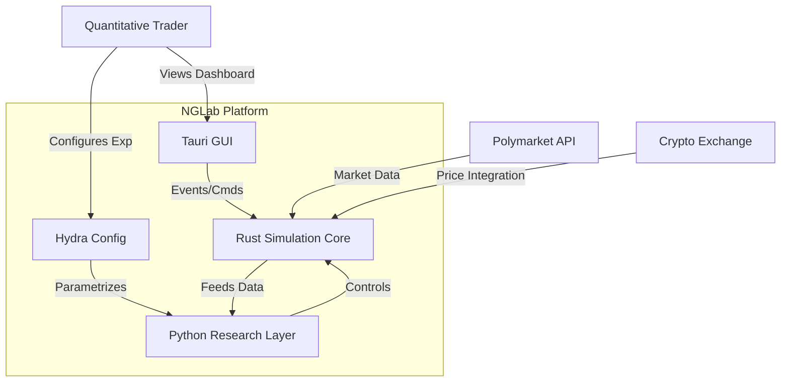
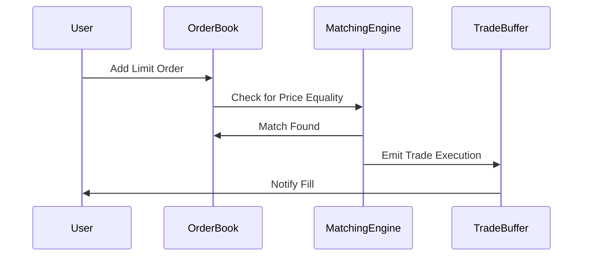
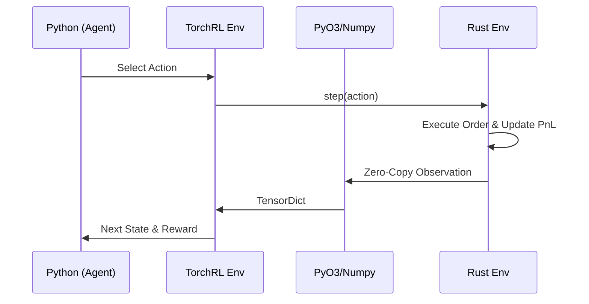
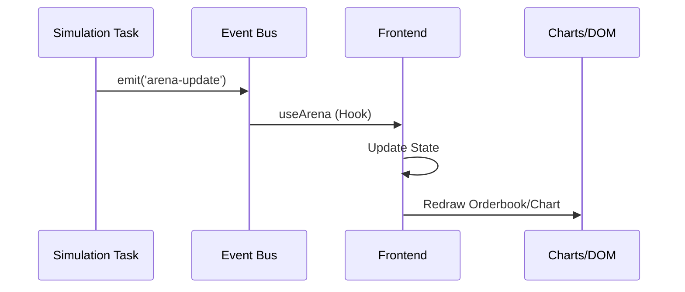

# NGLab Architecture: The Blueprint

> **System Overview**: Design Patterns, Component Boundaries, and Data Flow.

NGLab is a sophisticated **Multimodal Deep Reinforcement Learning Platform** for financial trading. It follows a strict **Hexagonal Architecture** (Ports & Adapters) to decouple the high-performance core from external interfaces.

---

## 1. System Context Diagram

Where does NGLab fit in the world?



---

## 2. Directory Structure Map

A quick reference to where the logic lives.

| Directory | Layer | Purpose | Key Technologies |
| :--- | :--- | :--- | :--- |
| `/rust` | **Simulation** | Matching Engine, Risk, Gym Env | Tokio, PyO3, Serde |
| `/python` | **Intelligence** | Models, Agents, Training Loops | PyTorch, Hydra, Optuna |
| `/typescript` | **Interface** | GUI, Charts, Commands | React 19, Tauri 2.0, Vite |
| `/deploy` | **Ops** | CI/CD, Docker, Kubernetes | GitHub Actions, Docker Compose |
| `/scripts` | **Tools** | Setup, Benchmarks, Maintenance | Bash, Just |

---

## 3. Layer 1: Simulation Engine (Rust)

**Location:** `/rust`

### Core Components

#### 1. TradingEnv (Gymnasium-compatible)
**File:** `rust/src/simulation/gym.rs`

A reinforcement learning environment following the Gymnasium API standard.

**Features:**
- **Action Space**: Discrete (hold, buy, sell) or continuous
- **Observation Space**: Price history with configurable lookback window
- **Reward Function**: Risk-adjusted returns (Sharpe ratio)
- **State Management**: Portfolio value, position tracking, cash management
- **PyO3 Integration**: Zero-copy numpy array transfers to Python

**Key Methods:**
```rust
pub fn new(initial_cash: f64, lookback_window: usize, transaction_cost: f64) -> Self
pub fn reset(&mut self, seed: Option<u64>) -> (Array1<f64>, HashMap<String, f64>)
pub fn step(&mut self, action: i32) -> StepResult
```

**Performance Characteristics:**
- Step execution: <1ms
- Memory-efficient rolling window
- No heap allocations in hot path

#### 2. MultiAssetEnv (Portfolio Simulation)
**File:** `rust/src/simulation/multi_asset.rs`

Extension of the trading environment for multi-asset portfolio management.

**Features:**
- **Concurrent Simulation**: Simulates multiple order books and price series simultaneously.
- **Portfolio Management**: Tracks cash, asset positions, and total portfolio value across all assets.
- **Advanced Observations**: Generates flattened feature vectors per asset (price, returns, volatility, imbalance, position).
- **Execution Engine**: Matches actions against individual `OrderBook` instances with synthetic liquidity and stochastic slippage.
- **Native & Python API**: Unified core logic with specialized entry points for Rust and Python.

#### 3. OrderBook (Central Limit Order Book)
**File:** `rust/src/simulation/orderbook.rs`

A production-grade CLOB implementation with price-time priority matching.

**Architecture:**
```
OrderBook
├── bids: BTreeMap<OrderedFloat<f64>, PriceLevel>  (sorted descending)
├── asks: BTreeMap<OrderedFloat<f64>, PriceLevel>  (sorted ascending)
└── orders: HashMap<u64, Order>                     (fast lookup by ID)

PriceLevel
├── price: f64
├── total_volume: u64
└── orders: VecDeque<Order>  (FIFO queue for price-time priority)
```

**Features:**
- **Matching Algorithm**: Price-time priority FIFO
- **Queue Position Tracking**: For HFT simulation accuracy
- **Advanced Orders**: 
  - **Iceberg**: Only part of the order is visible; refills from hidden quantity and resets priority on refill.
  - **Trailing Stop**: Trigger price adjusts dynamically as market moves favorably.
  - **Stop-Loss/Take-Profit**: Standard price-triggered conversion to market/limit orders.
- **Serialization**: Full state persistence with Serde
- **Performance**: O(log n) insertion, O(1) best bid/ask

**Key Methods:**
```rust
pub fn add_order(&mut self, order: Order) -> Vec<Trade>
pub fn cancel_order(&mut self, order_id: u64) -> Result<Order>
pub fn get_best_bid(&self) -> Option<f64>
pub fn get_best_ask(&self) -> Option<f64>
pub fn get_price_levels(&self, depth: usize) -> (Vec<PriceLevel>, Vec<PriceLevel>)
```

#### 4. PolymarketArena
**File:** `rust/src/simulation/polymarket.rs`

Prediction market simulation using conditional token framework.

**Features:**
- **Binary Outcome Markets**: Yes/No token pairs
- **Collateral Management**: USDC-based accounts
- **Market Making**: Automated market maker (AMM) simulation
- **Unrealized PnL**: Real-time profit/loss tracking
- **Position Management**: Long/short position tracking

**Architecture:**
```
PolymarketArena
├── markets: HashMap<String, Market>
├── accounts: HashMap<String, Account>
└── trades: Vec<Trade>

Market
├── yes_tokens: f64
├── no_tokens: f64
├── collateral: f64
└── outcome: Option<bool>
```

#### 5. Financial Models
**Location:** `rust/src/models/`

Advanced quantitative finance models for pricing and risk management.

- **Black-Scholes** (`black_scholes.rs`): European option pricing
- **Rough Heston** (`rough_heston.rs`): Rough volatility path simulation
- **Rough Bergomi** (`rough_bergomi.rs`): Alternative rough volatility model
- **Credit Risk** (`credit_risk.rs`): Default probability modeling

#### 6. Time Series Forecasting ("Project Moon")
**Location:** `rust/src/moon/`

Classical time series forecasting methods.

- **ARIMA** (`arima.rs`): AutoRegressive Integrated Moving Average
- **GARCH** (`garch.rs`): Volatility modeling
- **Exponential Smoothing** (`es.rs`): Trend and seasonality
- **Prophet** (`prophet.rs`): Changepoint-based forecasting (partial)

#### 7. Web Scraping & Data Collection
**Location:** `rust/src/web/`

Real-time market data acquisition.

**PolymarketScraper** (`polymarket.rs`):
- Multiple frequency support (minutely to monthly)
- Historical price replay
- Asynchronous HTTP with Reqwest
- Rate limiting and error handling

---

## 4. Layer 2: Training & Learning (Python)

**Location:** `/python`

### Core Components

#### 1. Deep Learning Models
**Location:** `python/src/models/`

Comprehensive suite of time series and generative models.

**Generative Models:**
- **VAE** (`vae.py`): Variational Auto-Encoder for time series
  - Encoder types: Transformer, Mamba, LSTM, GRU, xLSTM
  - Reparameterization trick for gradient flow
  - KL divergence regularization
- **Diffusion UNet** (`diffusion_unet.py`): 1D diffusion model
- **TimeGAN** (`gan_networks.py`): Adversarial time series generation

**Sequence Models:**
- **CNN** (`cnn.py`): Rolling window convolutional networks
- **RNN Variants** (`rnn.py`): LSTM, GRU with dropout
- **xLSTM** (`xlstm.py`): Extended LSTM architecture
- **Mamba** (`tsmamba.py`): State space model for sequences
- **NSTransformer** (`nstransformer.py`): Non-stationary Transformer

**Model Architecture:**
```python
TimeSeriesBackbone
├── encoder: Union[TransformerEncoder, MambaBlock, LSTM, GRU]
├── decoder: Union[TransformerDecoder, Linear]
└── head: TaskHead (classification/regression)

VAE
├── encoder: TimeSeriesBackbone
├── mu_layer: Linear
├── logvar_layer: Linear
└── decoder: TimeSeriesBackbone
```

#### 2. Training Pipeline
**Location:** `python/src/pipeline/`

PyTorch Lightning-based training infrastructure.

**Lightning Modules:**
- `vae_module.py`: VAE training with KL annealing
- `diffusion_module.py`: Diffusion model training
- `gan_module.py`: GAN training with discriminator
- `sl_module.py`: Supervised learning
- `rl_module.py`: Reinforcement learning

**Hyperparameter Optimization:**
- **Optuna Integration** (`hpo/`): Bayesian optimization
- **Custom Objectives** (`objectives/`): Task-specific metrics
- **Pruning**: Early stopping for unpromising trials

**Training Scripts:**
- `train.py`: Generic training entry point
- `train_ppo.py`: Proximal Policy Optimization
- `train_sac.py`: Soft Actor-Critic

#### 3. Reinforcement Learning Agents
**Location:** `python/src/agents/`

TorchRL-based agent implementations.

**TradingEnvWrapper** (`env_wrapper.py`):
- Wraps Rust TradingEnv for TorchRL compatibility
- TensorDict observation/action spaces
- Automatic batching and GPU transfer

**RL Algorithms:**
- PPO (Proximal Policy Optimization)
- SAC (Soft Actor-Critic)
- Custom policy networks

#### 4. Trading Policies
**Location:** `python/src/policies/`

Strategy implementations for trading.

- **Base Policy** (`base.py`): Abstract policy interface
- **Regular Policy** (`regular.py`): Simple rule-based strategies
- **Threshold Policy** (`threshold.py`): Threshold-based trading
- **Neural Policy** (`neural.py`): Deep learning-based strategies
- **Black-Scholes** (`black_scholes.py`): Options pricing strategy

#### 5. Configuration Management
**Location:** `python/src/conf/`

Hydra-based hierarchical configuration.

```
conf/
├── config.yaml          # Main configuration
├── task/                # Task-specific configs
├── model/               # Model architectures
├── env/                 # Environment settings
└── algorithm/           # Training algorithms
```

**Benefits:**
- Type-safe configuration with dataclasses
- Composition and overrides
- Experiment tracking integration
- Command-line overrides: `python train.py model=vae model.latent_dim=128`

---

## 5. Layer 3: User Interface (TypeScript/Tauri)

**Location:** `/typescript`

### Frontend Architecture (React)

#### 1. Main Application
**File:** `typescript/src/App.tsx`

Tab-based navigation with real-time updates.

**Tabs:**
- **Simulation**: Live trading environment visualization
- **Scraper**: Polymarket data collection interface
- **Analysis**: Market analysis tools
- **Prediction**: Model prediction display
- **Pricing**: Options pricing calculator

#### 2. Custom Hooks

**useArena** (`hooks/useArena.ts`):
```typescript
interface ArenaState {
  stepInfo: StepInfo;        // Portfolio, position, cash, Sharpe
  orderBook: OrderBook;      // Live order book snapshot
  priceHistory: number[];    // Capped at 200 points
  isRunning: boolean;
}

// Listens to Tauri 'arena-update' events
const { arenaState, start, stop } = useArena();
```

**usePolymarket** (`hooks/usePolymarket.ts`):
- Live price streaming from Polymarket API
- Market selection and filtering
- Historical data replay

#### 3. Components

**PriceChart** (`components/charts/PriceChart.tsx`):
- Lightweight-charts integration
- Real-time candlestick/line charts
- Performance-optimized (60 FPS target)

**OrderBook** (`components/dashboard/OrderBook.tsx`):
- Real-time bid/ask visualization
- Depth chart display
- Price level highlighting

### Backend Architecture (Tauri)

**Location:** `typescript/src-tauri`

#### Tauri Backend (Rust)
**File:** `src-tauri/src/lib.rs`

**Architecture:**
```rust
ArenaState
├── env: Arc<Mutex<TradingEnv>>    // Thread-safe environment
└── task_handle: Option<JoinHandle> // Simulation loop task

// Event-driven architecture
tokio::spawn(async move {
    loop {
        let step_info = env.lock().unwrap().step(action);
        app_handle.emit_all("arena-update", ArenaUpdate { ... });
        tokio::time::sleep(Duration::from_millis(100)).await;
    }
});
```

**Tauri Commands:**
```rust
#[tauri::command]
async fn start_arena(state: State<'_, ArenaState>) -> Result<()>

#[tauri::command]
async fn stop_arena(state: State<'_, ArenaState>) -> Result<()>

#[tauri::command]
fn get_orderbook() -> OrderBookSnapshot
```

**Event Flow:**
1. Frontend calls `invoke('start_arena')`
2. Backend spawns Tokio task for simulation loop
3. Each step emits `arena-update` event
4. Frontend `useArena` hook receives updates
5. React components re-render with new data

---

## Data Flow

### Training Pipeline Data Flow

```
┌──────────────┐
│ Market Data  │ (CSV, API, Live Stream)
└──────┬───────┘
       │
       ▼
┌──────────────┐
│ Preprocessor │ (Normalization, Feature Engineering)
└──────┬───────┘
       │
       ▼
┌──────────────┐
│  TradingEnv  │ (Rust Simulation)
│    (Rust)    │
└──────┬───────┘
       │ PyO3
       │ Zero-copy NumPy
       ▼
┌──────────────┐
│ TorchRL Env  │ (Python Wrapper)
│   Wrapper    │
└──────┬───────┘
       │
       ▼
┌──────────────┐
│ RL Agent     │ (PPO, SAC, etc.)
│  Training    │
└──────┬───────┘
       │
       ▼
┌──────────────┐
│ Trained Model│ → Evaluation → Deployment
└──────────────┘
```

### Real-time Visualization Data Flow

```
┌──────────────┐
│ Market Feed  │ (Polymarket WebSocket)
└──────┬───────┘
       │
       ▼
┌──────────────┐
│PolymarketScraper│ (Rust)
└──────┬───────┘
       │
       ▼
┌──────────────┐
│ TradingEnv   │ (Environment State Update)
└──────┬───────┘
       │
       ▼
┌──────────────┐
│ Tauri Event  │ (arena-update emission)
│   System     │
└──────┬───────┘
       │
       ▼
┌──────────────┐
│ React Hook   │ (useArena)
│  (Frontend)  │
└──────┬───────┘
       │
       ▼
┌──────────────┐
│ Chart Update │ (PriceChart, OrderBook)
└──────────────┘
```

---
## 6. Key Design Patterns

### 6.1 Zero-Copy Data Transfer (Rust ↔ Python)

Using PyO3 and numpy crate for efficient memory sharing. This pattern avoids expensive serialization during high-frequency stepping.

```rust
// Rust side
use numpy::{PyArray1, ToPyArray};
use pyo3::prelude::*;

#[pyclass]
pub struct TradingEnv {
    observation: Array1<f64>,
}

#[pymethods]
impl TradingEnv {
    fn get_observation<'py>(&self, py: Python<'py>) -> &'py PyArray1<f64> {
        self.observation.to_pyarray(py)  // Zero-copy transfer
    }
}
```

```python
# Python side
import nglab
import numpy as np

env = nglab.TradingEnv(10000.0, 50, 0.001)
obs, _ = env.reset()  # obs is numpy array, no copy
```

### 6.2 Event-Driven Architecture (Tauri)

Decoupled frontend-backend communication enabling responsive UI even under heavy simulation load.

```typescript
// Frontend subscribes to events
useEffect(() => {
  const unlisten = listen('arena-update', (event) => {
    setArenaState(event.payload);
  });
  return () => { unlisten.then(f => f()); };
}, []);

// Backend emits events
app_handle.emit_all("arena-update", payload)?;
```

### 6.3 Configuration Composition (Hydra)

Hierarchical configuration with runtime overrides allows for seamless experiment scaling.

```yaml
# config.yaml
defaults:
  - model: vae
  - env: trading
  - algorithm: ppo

# model/vae.yaml
latent_dim: 64
encoder_type: transformer

# CLI override
$ python train.py model.latent_dim=128 env.initial_cash=50000
```

### 6.4 Async Runtime (Tokio)

Non-blocking I/O for scalable data ingestion.

```rust
#[tokio::main]
async fn main() {
    let scraper = PolymarketScraper::new();

    // Concurrent data fetching
    let (prices, metadata) = tokio::join!(
        scraper.fetch_prices(),
        scraper.fetch_metadata()
    );
}
```

---

## 7. Data Flow Specification

Data moves through the system in three distinct loops.

### 7.1 The Fast Loop (Simulation)
*Frequency: 10kHz+*



1.  **Input**: Limit Order (Add/Cancel).
2.  **Process**: `OrderBook` matching engine.
3.  **Output**: `Trade` events, `QueuePosition` updates.
4.  **Storage**: In-memory ring buffer.

### 7.2 The Learning Loop (RL)
*Frequency: User Defined (e.g., 1 minute candles)*



1.  **Observation**: Rust builds a flat `Vec<f64>` feature vector.
2.  **Bridge**: `PyArray` (numpy) wraps the memory pointer (Zero-Copy).
3.  **Inference**: Python Model $\pi(s)$ computes action $a$.
4.  **Action**: Integer/Float passed back to Rust via `step(a)`.
5.  **Reward**: Rust computes $r_t$ and returns it.

### 7.3 The UI Loop (Visualization)
*Frequency: 60Hz (Throttled)*



1.  **Event**: `ArenaUpdate` struct is serialized to JSON.
2.  **Transport**: Tauri Event Bus (`app.emit`).
3.  **Render**: React `useEffect` triggers a canvas redraw.

---

## 8. Key Design Decisions

### 8.1 Why Rust for Simulation?
Python is too slow for Order Book matching ($O(N)$ list operations vs Rust's $O(\log N)$ B-Trees). Garbage collection pauses in Python would destroy the determinism required for accurate backtesting.

### 8.2 Why Python for ML?
The ecosystem. PyTorch, HuggingFace, and Optuna are unrivaled. We bridge the two worlds using `PyO3`, giving us "C++ speed with Python usability".

### 8.3 Why Tauri?
Electron is bloated (Chromium + Node.js bundle). Tauri uses the OS's native webview (WebKit on Linux/macOS, WebView2 on Windows) and a lightweight Rust backend. This results in a <10MB binary vs >100MB for Electron.

---

## 9. Performance Characteristics

### Rust Layer
| Component | Metric | Target | Actual |
|-----------|--------|--------|--------|
| OrderBook Insert | Latency | <1ms | ~0.1ms |
| TradingEnv Step | Latency | <1ms | ~0.5ms |
| Order Matching | Throughput | >10k ops/sec | ~50k ops/sec |
| Memory Usage | RAM | <100MB | ~50MB |

### Python Layer
| Component | Metric | Target | Notes |
|-----------|--------|--------|-------|
| Model Forward Pass | Latency | <10ms | Depends on model size |
| Training Step | Latency | <100ms | Includes optimizer step |
| Data Loading | Throughput | >1000 samples/sec | With prefetching |

### Frontend Layer
| Component | Metric | Target | Notes |
|-----------|--------|--------|-------|
| Chart Rendering | FPS | 60 | Lightweight-charts optimized |
| Event Processing | Latency | <50ms | Tauri IPC overhead |
| Memory Usage | RAM | <500MB | With 200-point history |

---

## 10. Scalability Considerations

### Horizontal Scaling
- **Training**: Distributed via PyTorch DDP or Ray
- **Simulation**: Multiple environment instances in parallel
- **Data Collection**: Sharded by market or time period

### Vertical Scaling
- **GPU Acceleration**: Full PyTorch/TorchRL support
- **Multi-threading**: Tokio runtime for concurrent I/O
- **Memory Efficiency**: Streaming data processing, bounded buffers

---

## 11. Security Considerations

### API Keys
- Stored in environment variables
- Never committed to version control
- Validated before use

### Data Validation
- Input sanitization at all boundaries
- Type checking with strong typing (Rust, TypeScript)
- Schema validation for external data

### Sandboxing
- Tauri provides OS-level sandboxing
- Limited filesystem access
- Content Security Policy (CSP) for web views

---

## 12. Deployment Topology

### Local Research (Dev)
- **Single Machine**: 1 GPU, Multi-core CPU.
- **Process**: `cargo run` hosts the simulation; Python is loaded as a dynamic library (`.so`).

### Development
```
Developer Machine
├── Rust: cargo build
├── Python: uv sync && maturin develop
└── Tauri: npm run tauri dev
```


### Cloud Training (Prod - Planned)
```
Cloud Infrastructure
├── Training Cluster (GPU)
│   ├── Model training jobs
│   └── Hyperparameter optimization
├── Inference Service (API)
│   ├── Model serving
│   └── Real-time predictions
└── Desktop App Distribution
    ├── Linux: AppImage
    ├── macOS: DMG
    └── Windows: MSI
```

---

## 13. Testing Strategy

### Unit Tests
- **Rust**: `#[test]` modules, `cargo test`
- **Python**: pytest, `tests/` directory
- **TypeScript**: Jest/Vitest (future)

### Integration Tests
- **Rust-Python**: PyO3 bindings verification
- **Tauri Events**: Frontend-backend communication
- **End-to-End**: Full training pipeline

### Benchmarks
- **Criterion**: Rust performance regression testing
- **pytest-benchmark**: Python performance testing
- **Lighthouse**: Frontend performance audits (future)

---

## 14. Future Architecture Enhancements

### Short-term (3-6 months)
- [ ] Add model serving API (FastAPI/Actix-web)
- [ ] Implement distributed training with Ray
- [ ] Add real-time backtesting engine
- [ ] Enhance monitoring with Prometheus/Grafana

### Medium-term (6-12 months)
- [ ] Microservices architecture for scalability
- [ ] Multi-asset trading support
- [ ] Advanced risk management system
- [ ] Cloud deployment automation

### Long-term (12+ months)
- [ ] Multi-agent reinforcement learning
- [ ] Causal inference integration
- [ ] Explainable AI for trading decisions
- [ ] Regulatory compliance framework

---

## Related Documentation

- [CLAUDE.md](CLAUDE.md) - Tech stack overview
- [IMPROVEMENT_PLAN.md](IMPROVEMENTS.md) - Development roadmap
- [CONTRIBUTING.md](CONTRIBUTING.md) - Contribution guidelines
- [README.md](README.md) - Getting started

---

**Last Updated:** 2026-01-21
**Version:** 2.1.0 (The Omnibus Edition + Code Snippets + Diagrams)
**Maintainer:** NGLab Team
