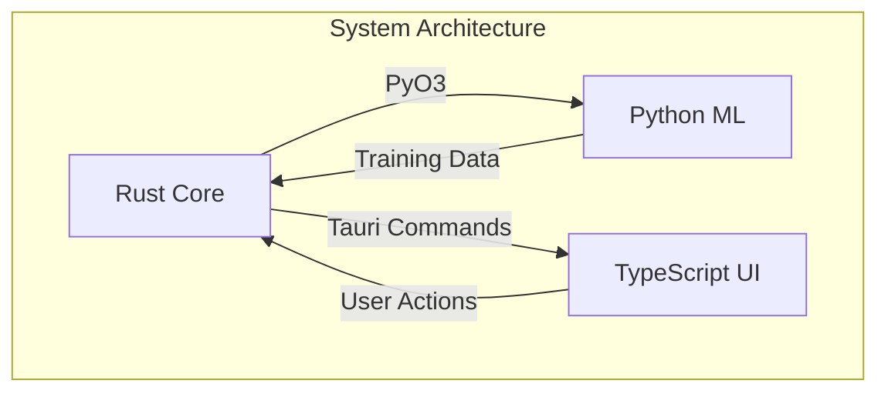

# NGLab Human Understanding & Improvement Roadmap

A comprehensive guide to making the NGLab codebase more understandable, maintainable, and welcoming to contributors.

---

## Table of Contents

1. [Executive Summary](#executive-summary)
2. [Documentation](#documentation)
3. [Naming & Code Clarity](#naming--code-clarity)
4. [Architectural Improvements](#architectural-improvements)
5. [Code Cleanup](#code-cleanup)
6. [Developer Experience](#developer-experience)
7. [Testing & Validation](#testing--validation)
8. [Implementation Plan](#implementation-plan)
9. [Success Metrics](#success-metrics)

---

## Executive Summary

This document provides a systematic approach to improving the NGLab codebase for human understanding. The goal is to make the codebase:

- **Self-documenting** - Code that explains itself through clear naming and inline comments
- **Well-architected** - Logical structure that matches mental models
- **Approachable** - New contributors can become productive within 30 minutes

---

## Documentation

### Rust Layer (Critical Priority)

**Current State**: ~100 `missing documentation` warnings from `cargo doc`

| Priority    | Module           | Files | Action                                    | Owner |
| ----------- | ---------------- | ----- | ----------------------------------------- | ----- |
| 🔴 Critical | `simulation/`    | 13    | Module-level `//!` docs + all public APIs | -     |
| 🔴 Critical | `execution/`     | 6     | Algorithm docs with complexity analysis   | -     |
| 🟠 High     | `web/exchanges/` | 5     | Trait documentation + integration guides  | -     |
| 🟠 High     | `models/`        | 6     | ML inference pipeline documentation       | -     |
| 🟡 Medium   | `security/`      | 4     | Security model explanation                | -     |

**Enforcement**: Add `#![warn(missing_docs)]` to `lib.rs` (already present, needs CI enforcement)

### Python Layer

| Task                                          | Status | Notes                                    |
| --------------------------------------------- | ------ | ---------------------------------------- |
| Google-style docstrings for all public APIs   | ⬜     | Focus on `models/`, `envs/`, `pipeline/` |
| Update `_nglab.pyi` stub file                 | ⬜     | Must match current Rust bindings exactly |
| Document dataclass configs with `#:` comments | ⬜     | `configs/` directory                     |
| Add type hints to all public functions        | ⬜     | Use `from __future__ import annotations` |

### TypeScript Layer

| Task                                    | Status | Notes                                       |
| --------------------------------------- | ------ | ------------------------------------------- |
| JSDoc for all exported components       | ⬜     | Priority: hooks, complex components         |
| Document props interfaces with `@param` | ⬜     | Focus on `terminal/`, `charts/`             |
| Add `@example` blocks for complex hooks | ⬜     | `useArena`, `usePolymarket`, `useStreaming` |
| README.md per feature folder            | ⬜     | Explain purpose, usage patterns             |

### Visual Documentation

Create Mermaid diagrams for:



- [ ] System architecture (Rust ↔ Python ↔ TypeScript)
- [ ] Data flow (Order → Arena → CLOB → Fill)
- [ ] Training pipeline (Gym → Policy → Training Loop)
- [ ] Streaming architecture (WebSocket → Events → UI)

---

## Naming & Code Clarity

### Naming Issues & Recommendations

| Location          | Current Problem               | Recommended Change                              | Impact |
| ----------------- | ----------------------------- | ----------------------------------------------- | ------ |
| `rust/src/moon/`  | Unclear purpose, cryptic name | Rename to `scrapers/` or `data_ingestion/`      | High   |
| `MultiAssetEnv`   | Overloaded responsibility     | Split into `MultiAssetEnv` + `PortfolioManager` | Medium |
| `ArenaUpdate`     | Too generic                   | Rename to `SimulationState` or `StepResult`     | Low    |
| `AlgoOrderWidget` | Abbreviation                  | `AlgorithmicOrderWidget` for clarity            | Low    |
| Various           | Magic numbers scattered       | Extract to named constants                      | Medium |

### Inline Comments Strategy

**High-Value Targets** (complex algorithms that need explanation):

1. **`orderbook.rs`** - Price-time priority matching, order cancellation logic
2. **`gym.rs`** - Reward calculation formulas, observation normalization
3. **`features.rs`** - Feature engineering pipeline, lag/lead calculations
4. **`streaming.rs`** - WebSocket reconnection, backoff strategy

### Comment Guidelines

```rust
// BAD: What the code does (reader can see this)
// Increment counter
counter += 1;

// GOOD: Why the code does it
// Backoff exponentially to avoid overwhelming server during outages
delay = delay.saturating_mul(2);
```

---

## Architectural Improvements

### Rust Architecture

#### Current Structure

```
rust/src/
├── simulation/     # Core trading simulation (13 files)
├── execution/      # Order execution algorithms (6 files)
├── web/            # HTTP/WebSocket handlers (10 files)
├── models/         # ML inference (6 files)
├── moon/           # Data scrapers (5 files) ← RENAME
├── security/       # Auth & crypto (4 files)
└── ... utilities
```

#### Proposed Domain Layer Extraction

```
rust/src/
├── domain/                    # [NEW] Pure domain logic
│   ├── orderbook.rs           # Move from simulation/
│   ├── portfolio.rs           # Extract from multi_asset.rs
│   ├── position.rs            # Extract position management
│   └── types.rs               # Shared domain types
├── simulation/                # Environment orchestration only
├── execution/                 # Execution algorithms (unchanged)
└── infrastructure/            # [NEW] External integrations
    ├── exchanges/             # Move from web/exchanges/
    ├── storage/               # Database adapters
    └── streaming/             # WebSocket handling
```

#### Trait-Based Exchange Abstraction

```rust
// Current: Scattered concrete implementations
pub struct Binance { ... }
pub struct Deribit { ... }

// Proposed: Clear trait hierarchy
pub trait Exchange: Send + Sync {
    fn name(&self) -> &str;
    async fn fetch_orderbook(&self) -> Result<OrderBook>;
    async fn submit_order(&self, order: Order) -> Result<OrderId>;
}

pub trait DataProvider: Send + Sync {
    async fn fetch_ohlcv(&self, symbol: &str, tf: Timeframe) -> Vec<Candle>;
}
```

#### Error Handling Hierarchy

```
errors/
├── mod.rs           # Re-exports & From impls
├── domain.rs        # DomainError (OrderError, PositionError)
├── infrastructure.rs # InfraError (NetworkError, StorageError)
└── application.rs   # AppError (wraps both, user-friendly messages)
```

### Python Architecture

#### Registry Consolidation

```python
# Current: Multiple scattered registries
ModelFactory.register(...)
EnvFactory.register(...)

# Proposed: Unified registry with auto-discovery
@register("model")
class MyModel(nn.Module): ...

# Automatically discovered on import
Registry.get("model", "MyModel")
```

#### Feature Flags

```python
# src/features/__init__.py
class FeatureFlags:
    USE_RUST_ENV: bool = True      # Fallback to Python if False
    ENABLE_PROFILING: bool = False
    USE_MIXED_PRECISION: bool = True
```

### TypeScript Architecture

#### State Management Consolidation

**Current**: Multiple hooks with overlapping concerns

- `useArena()` - Arena data
- `usePolymarket()` - Live prices, streaming
- `useStreaming()` - Connection state

**Proposed**: Zustand store with slices

```typescript
// stores/tradingStore.ts
export const useTradingStore = create<TradingState>()(
  devtools(
    persist(
      (set, get) => ({
        // Arena slice
        arenaData: null,
        // Streaming slice
        livePrices: {},
        connectionStatus: "disconnected",
      }),
      { name: "trading-storage" },
    ),
  ),
);
```

#### Component Organization

```
components/
├── features/           # Feature-based organization
│   ├── trading/
│   │   ├── Chart/
│   │   ├── OrderBook/
│   │   └── TradingForm/
│   ├── portfolio/
│   └── analytics/
├── shared/             # Truly reusable components
│   ├── Button/
│   ├── Modal/
│   └── Card/
└── layouts/            # Page layouts only
```

---

## Code Cleanup

### Rust Cleanup Tasks

| Issue                       | File                             | Action                          |
| --------------------------- | -------------------------------- | ------------------------------- |
| Unused `slice_qty`          | `execution/pov.rs:43`            | Prefix with `_` or use          |
| Unused `remaining_qty`      | `execution/twap.rs:44`           | Prefix with `_` or use          |
| Unnecessary `mut`           | `simulation/paper_trading.rs:68` | Remove `mut`                    |
| Dead code `symbol`          | `web/exchanges/binance.rs:23`    | Remove or `#[allow(dead_code)]` |
| Dead code `instrument_name` | `web/exchanges/deribit.rs:40`    | Remove or `#[allow(dead_code)]` |

### TypeScript Cleanup Tasks

| Issue                                              | Action                                 |
| -------------------------------------------------- | -------------------------------------- |
| Unused imports (`ShoppingCart`, `CandlestickData`) | Remove from imports                    |
| Magic numbers in mock generators                   | Extract to `constants.ts`              |
| Duplicate mock data generators                     | Consolidate to `__mocks__/`            |
| Inconsistent button styling                        | Create `Button` component in `shared/` |

---

## Developer Experience

### Tooling Matrix

| Tool              | Purpose             | Status        | Action               |
| ----------------- | ------------------- | ------------- | -------------------- |
| `just`            | Task runner         | ✅ Configured | -                    |
| `pre-commit`      | Linting hooks       | ⚠️ Partial    | Add Python/TS checks |
| `cargo-deny`      | Dependency auditing | ❌ Missing    | Configure in CI      |
| `typedoc`         | TS documentation    | ❌ Missing    | Add to build         |
| `cargo tarpaulin` | Rust coverage       | ❌ Missing    | Add to CI            |

### Recommended IDE Configuration

```json
// .vscode/settings.json
{
  "rust-analyzer.cargo.features": ["python"],
  "rust-analyzer.check.command": "clippy",
  "editor.formatOnSave": true,
  "[python]": {
    "editor.defaultFormatter": "charliermarsh.ruff"
  },
  "[typescript][typescriptreact]": {
    "editor.defaultFormatter": "esbenp.prettier-vscode"
  }
}
```

### Onboarding Improvements

- [ ] Create `QUICKSTART.md` with 5-minute setup guide
- [ ] Add `just setup` command for full environment setup
- [ ] Create `GLOSSARY.md` defining domain terms (CLOB, LOB, Slippage, Sharpe, etc.)
- [ ] Document environment variables in `.env.example`
- [ ] Add common debugging scenarios to `TROUBLESHOOTING.md`

---

## Testing & Validation

### Coverage Targets

| Layer      | Current | Target | Strategy                                        |
| ---------- | ------- | ------ | ----------------------------------------------- |
| Rust       | ~60%    | 80%    | Property-based testing (proptest) for orderbook |
| Python     | ~55%    | 70%    | Fixture-based testing, GPU mocking              |
| TypeScript | ~30%    | 60%    | React Testing Library + MSW for API mocking     |

### Integration Test Scenarios

1. **Order Flow**: Submit → Match → Fill → Position Update
2. **Training Loop**: Reset → Step → Collect → Update Policy
3. **Streaming**: Connect → Subscribe → Data → Reconnect on failure

### Performance Benchmarks

```rust
// Add Criterion benchmarks: benches/orderbook_bench.rs
fn bench_order_matching(c: &mut Criterion) {
    c.bench_function("match_1000_orders", |b| {
        b.iter(|| {
            let mut ob = OrderBook::new();
            for _ in 0..1000 { ob.add_order(random_order()); }
        })
    });
}
```

---

## Implementation Plan

### Phase 1: Quick Wins (1-2 days)

- [ ] Fix all Rust `missing_docs` warnings in critical modules
- [ ] Remove all unused imports/variables (Rust + TypeScript)
- [ ] Add `.vscode/settings.json` with recommended config
- [ ] Create `GLOSSARY.md` for domain terminology
- [ ] Add `/// Auto-generated` header to `_nglab.pyi`

### Phase 2: Documentation Sprint (1 week)

- [ ] Full JSDoc coverage for TypeScript components
- [ ] Google-style docstrings for Python public APIs
- [ ] Create Mermaid architecture diagrams in `docs/`
- [ ] Add 2-3 new ADRs for recent features

### Phase 3: Architectural Refactoring (2-3 weeks)

- [ ] Rename `moon/` to `scrapers/`
- [ ] Extract domain layer in Rust
- [ ] Consolidate Python registries
- [ ] Implement Zustand store for TypeScript state

### Phase 4: Testing & Validation (1-2 weeks)

- [ ] Add property-based tests for orderbook
- [ ] Implement E2E integration tests
- [ ] Setup performance benchmarking in CI
- [ ] Reach coverage targets

---

## Success Metrics

| Metric                    | Baseline | Target | Measurement                               |
| ------------------------- | -------- | ------ | ----------------------------------------- |
| Rust doc warnings         | ~100     | 0      | `cargo doc 2>&1 \| grep warning \| wc -l` |
| TypeScript lint warnings  | ~20      | 0      | `npm run lint \| wc -l`                   |
| Python docstring coverage | ~40%     | 90%    | `interrogate -v python/src/`              |
| ADR count                 | 12       | 15+    | `ls docs/*.md \| wc -l`                   |
| Test coverage (overall)   | ~50%     | 75%    | CI metrics                                |
| Build time                | ~60s     | <45s   | CI metrics                                |
| Onboarding time           | Unknown  | <30min | New developer survey                      |
| Code complexity (avg)     | Unknown  | <10    | `cargo clippy` / `radon cc`               |

---

## Appendix: Quick Reference

### Docstring Templates

**Rust:**

````rust
/// Short description of what this does.
///
/// # Arguments
/// * `param` - Description of parameter
///
/// # Returns
/// Description of return value
///
/// # Example
/// ```
/// let result = my_function(42);
/// ```
pub fn my_function(param: i32) -> i32 { ... }
````

**Python:**

```python
def my_function(param: int) -> int:
    """Short description of what this does.

    Args:
        param: Description of parameter.

    Returns:
        Description of return value.

    Example:
        >>> result = my_function(42)
    """
```

**TypeScript:**

````typescript
/**
 * Short description of what this does.
 *
 * @param param - Description of parameter
 * @returns Description of return value
 *
 * @example
 * ```tsx
 * const result = myFunction(42);
 * ```
 */
export function myFunction(param: number): number { ... }
````
